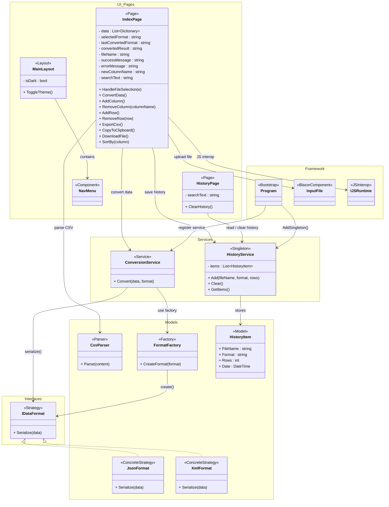

```mermaid
classDiagram

%% =========================
%% UI / PAGES
%% =========================

namespace UI_Pages {
    class IndexPage {
        <<Page>>
        - data : List~Dictionary<string,string>~
        - selectedFormat : string
        - lastConvertedFormat : string
        - convertedResult : string
        - fileName : string
        - successMessage : string
        - errorMessage : string
        - newColumnName : string
        - searchText : string
        + HandleFileSelection(e)
        + ConvertData()
        + AddColumn()
        + RemoveColumn(columnName)
        + AddRow()
        + RemoveRow(row)
        + ExportCsv()
        + CopyToClipboard()
        + DownloadFile()
        + SortBy(column)
    }

    class HistoryPage {
        <<Page>>
        - searchText : string
        + ClearHistory()
    }

    class MainLayout {
        <<Layout>>
        - isDark : bool
        + ToggleTheme()
    }

    class NavMenu {
        <<Component>>
    }
}

%% =========================
%% INTERFACES / STRATEGY
%% =========================

namespace Interfaces {
    class IDataFormat {
        <<Strategy>>
        + Serialize(data)
    }
}

%% =========================
%% MODELS / FORMATTERS
%% =========================

namespace Models {
    class JsonFormat {
        <<ConcreteStrategy>>
        + Serialize(data)
    }

    class XmlFormat {
        <<ConcreteStrategy>>
        + Serialize(data)
    }

    class CsvParser {
        <<Parser>>
        + Parse(content)
    }

    class FormatFactory {
        <<Factory>>
        + CreateFormat(format)
    }

    class HistoryItem {
        <<Model>>
        + FileName : string
        + Format : string
        + Rows : int
        + Date : DateTime
    }
}

%% =========================
%% SERVICES
%% =========================

namespace Services {
    class ConversionService {
        <<Service>>
        + Convert(data, format)
    }

    class HistoryService {
        <<Singleton>>
        - items : List~HistoryItem~
        + Add(fileName, format, rows)
        + Clear()
        + GetItems()
    }
}

%% =========================
%% FRAMEWORK / SYSTEM
%% =========================

namespace Framework {
    class Program {
        <<Bootstrap>>
    }

    class InputFile {
        <<BlazorComponent>>
    }

    class IJSRuntime {
        <<JSInterop>>
    }
}

%% =========================
%% RELATIONS
%% =========================

IDataFormat <|.. JsonFormat
IDataFormat <|.. XmlFormat

FormatFactory --> IDataFormat : create()
ConversionService --> FormatFactory : use factory
ConversionService --> IDataFormat : serialize()

IndexPage --> CsvParser : parse CSV
IndexPage --> ConversionService : convert data
IndexPage --> HistoryService : save history
IndexPage --> IJSRuntime : JS interop
IndexPage --> InputFile : upload file

HistoryPage --> HistoryService : read / clear history
MainLayout --> NavMenu : contains
Program --> HistoryService : AddSingleton()
Program --> ConversionService : register service

HistoryService --> HistoryItem : stores
```